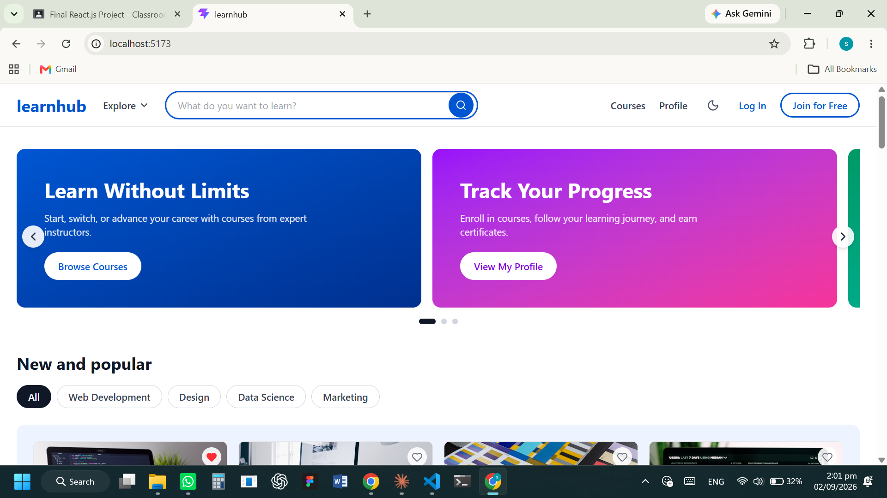
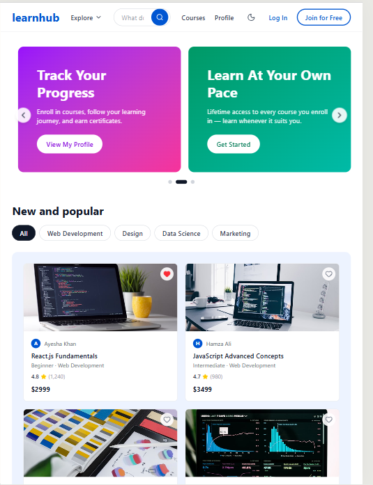
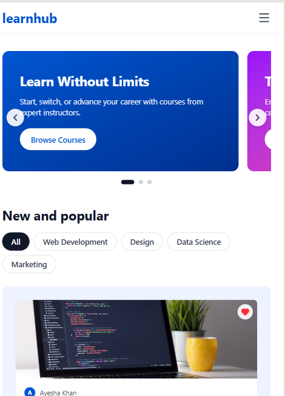

# LearnHub

An online learning platform built with React.js, where users can browse courses, track their learning progress, manage a wishlist, and maintain a personal profile — all in a fully responsive interface.

## Project Description

LearnHub is a React.js internship project (TechTide Corporation) that simulates a real-world online learning platform similar to Udemy or Coursera. Users can explore courses by category, enroll in them, track lesson-by-lesson progress, save courses to a wishlist, and customize their profile with a photo and cover banner. All data is persisted in the browser using `localStorage`, so a user's progress and preferences remain intact across sessions without needing a backend server.

## Features

- Browse and explore courses by role, category, level, and trending skill
- Detailed course pages with a full curriculum broken down by week
- Enroll in / remove courses, with automatic progress percentage calculation
- Mark individual lessons as complete and watch progress update in real time
- Wishlist system to save courses for later
- Editable profile with full name, email, university, department, semester, and bio
- Profile picture and cover banner upload directly from the user's device
- Certificate generation page for completed courses
- Dark mode / light mode toggle applied across the entire app
- Toast notifications for actions like enrolling, saving, and errors
- Custom 404 page for undefined routes
- Fully responsive design across desktop, tablet, and mobile screens

## Technologies Used

- **React 19** — component-based UI library
- **Vite** — fast development server and build tool
- **React Router DOM** — client-side routing and navigation
- **Tailwind CSS** — utility-first styling
- **Lucide React** — icon library
- **Browser localStorage** — client-side data persistence
- **ESLint** — code linting

## React Concepts Used

- `useState` — managing local component state (forms, edit mode, errors)
- `useEffect` — syncing state (profile, courses, wishlist, progress, theme) with `localStorage`
- `useContext` + Context API — global state shared across pages via a custom `AppContext`
- `useRef` — triggering hidden file inputs for photo/banner uploads
- Controlled components — all form inputs driven by React state
- Conditional rendering — toggling between view and edit modes on the Profile page
- React Router (`Routes`, `Route`, dynamic params) — page navigation and course detail routes
- Component reusability — shared components like `Button` used across multiple pages
- Lifting state up — enroll, wishlist, and lesson-completion logic centralized in `AppContext`

## Project Structure

```
learnhub/
├── src/
│   ├── pages/
│   │   ├── Home.jsx
│   │   ├── Courses.jsx
│   │   ├── CourseDetails.jsx
│   │   ├── Profile.jsx
│   │   ├── ExploreTopic.jsx
│   │   ├── Certificate.jsx
│   │   └── NotFound.jsx
│   ├── components/
│   │   ├── Navbar.jsx
│   │   ├── Footer.jsx
│   │   ├── Toast.jsx
│   │   ├── ScrollToTop.jsx
│   │   └── Button.jsx
│   ├── context/
│   │   └── AppContext.jsx
│   ├── data/
│   ├── App.jsx
│   └── main.jsx
├── public/
├── index.html
├── package.json
├── vite.config.js
└── eslint.config.js
```

## Installation Instructions

1. **Clone the repository**
   ```bash
   git clone https://github.com/aishasyeda2005/learn-Hub-learning-management-System-frontend-.git
   ```

2. **Navigate into the project folder**
   ```bash
   cd learn-Hub-learning-management-System-frontend-
   ```

3. **Install dependencies**
   ```bash
   npm install
   ```

4. **Start the development server**
   ```bash
   npm run dev
   ```

5. **Open the app**

   Visit `http://localhost:5173` in your browser.

## Screenshots

### Desktop View


### Tablet View


### Mobile View


## Live Demo

🔗 [https://learn-hub-learning-management-syste-nine.vercel.app/](https://learn-hub-learning-management-syste-nine.vercel.app/)

## GitHub Repository

🔗 [https://github.com/aishasyeda2005/learn-Hub-learning-management-System-frontend-](https://github.com/aishasyeda2005/learn-Hub-learning-management-System-frontend-)